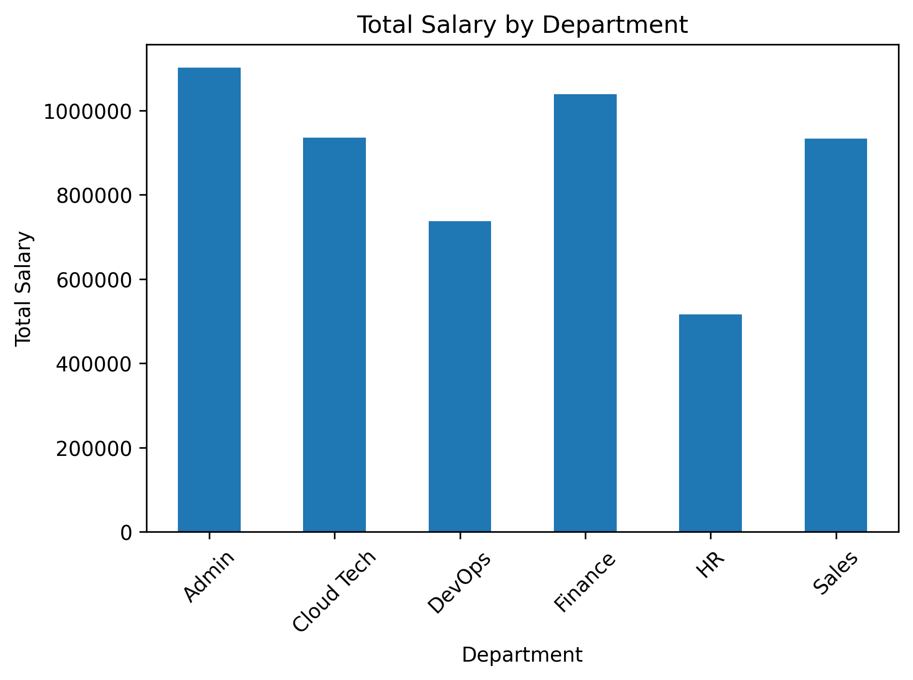
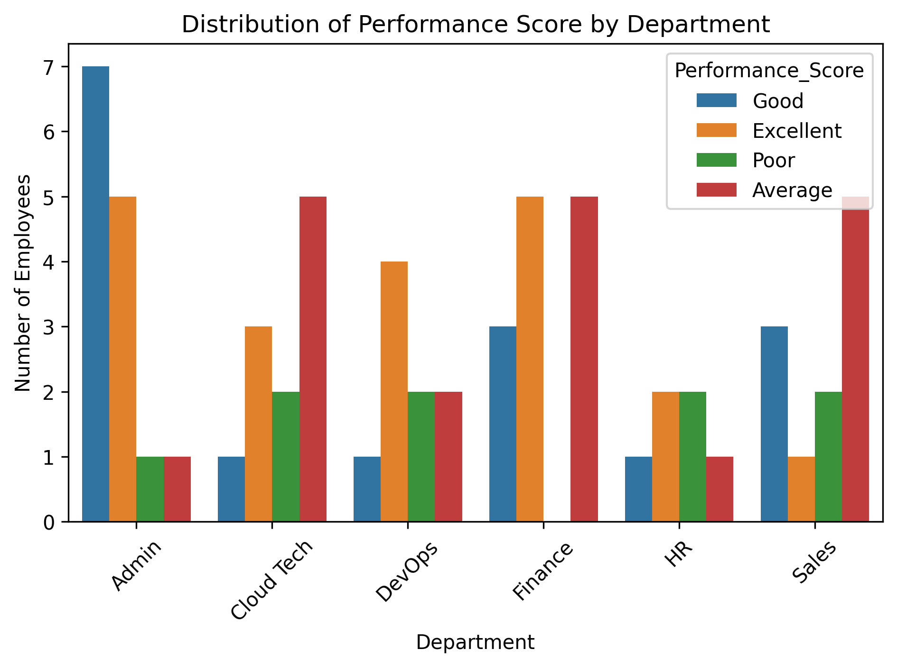
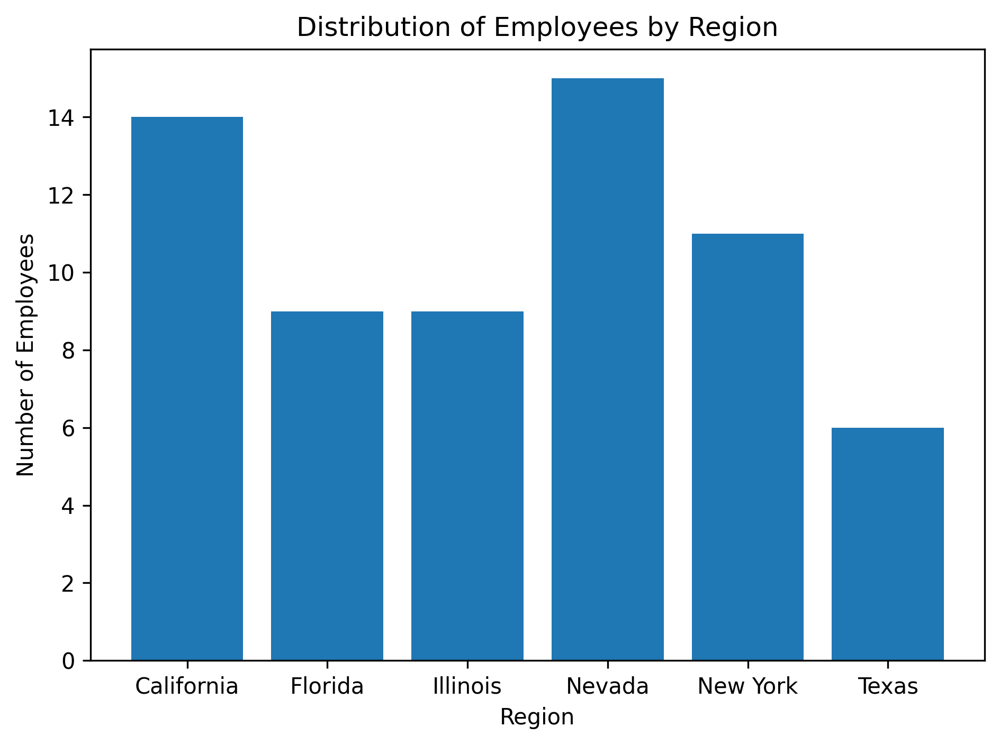

# Part 1 EDA Results

## Question 1: Total Salary by Department

**Results:**
- Admin: $1,101,877
- Finance: $1,038,823
- Cloud Tech: $936,323
- Sales: $933,188
- DevOps: $737,864
- HR: $516,494

---

## Question 2: Distribution of Performance by Department

**Key Findings:**
- Admin: 5 Excellent, 7 Good, 1 Average, 1 Poor
- Cloud Tech: 3 Excellent, 1 Good, 5 Average, 2 Poor
- DevOps: 4 Excellent, 1 Good, 2 Average, 2 Poor
- Finance: 5 Excellent, 3 Good, 5 Average
- HR: 2 Excellent, 1 Good, 1 Average, 2 Poor
- Sales: 1 Excellent, 3 Good, 5 Average, 2 Poor

---

## Question 3: Distribution of Employees by Region

**Results:**
- Nevada: 15 employees
- California: 14 employees
- New York: 11 employees
- Florida: 9 employees
- Illinois: 9 employees
- Texas: 6 employees

