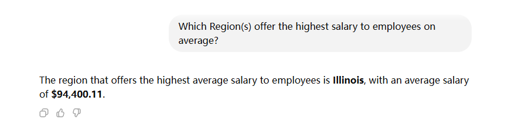
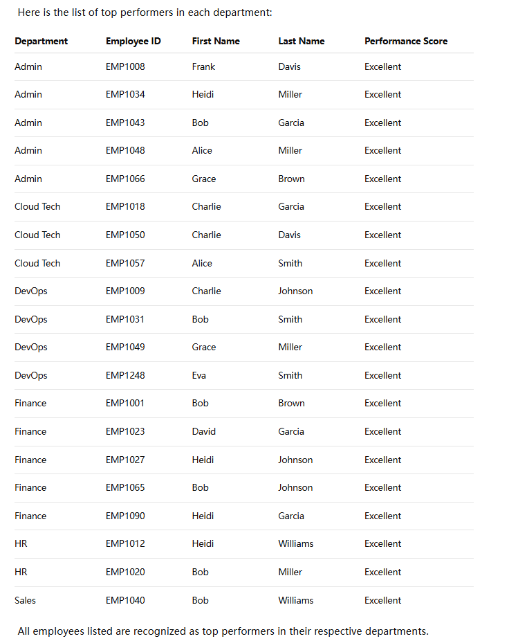
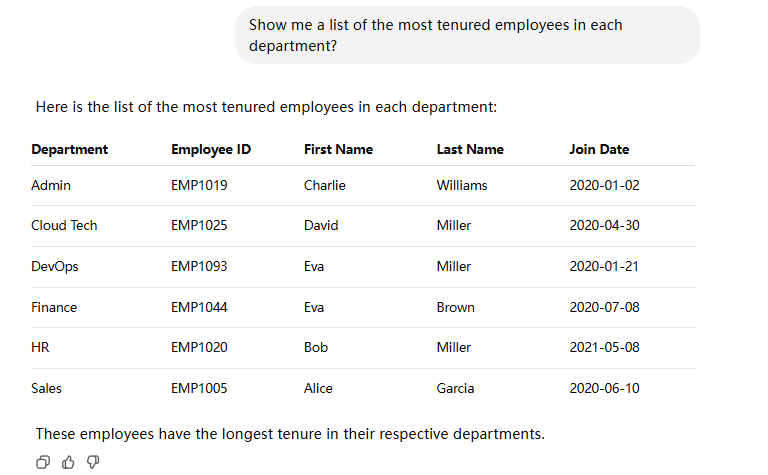

# Part 2 Agent Answers

## Question 1: Which Region(s) offer the highest salary to employees on average?

**Answer:** Illinois offers the highest average salary.

**Results:**
- Illinois: $94,400.11
- Texas: $87,022.67
- Florida: $86,901.67
- Nevada: $81,318.67
- New York: $79,266.36
- California: $78,385.15

---

## Question 2: Show me a list of top performers in each department?

**Answer:** 20 top performers (Performance_Score = 'Excellent') across all departments.

**Distribution:**
- Admin: 5 top performers
- Finance: 5 top performers
- DevOps: 4 top performers
- Cloud Tech: 3 top performers
- HR: 2 top performers
- Sales: 1 top performer

---

## Question 3: Show me a list of the most tenured employees in each department?

**Answer:** Most tenured employee in each department (based on earliest Join_Date):

- Admin: Charlie Williams (joined 2020-01-02)
- Cloud Tech: David Miller (joined 2020-04-30)
- DevOps: Eva Miller (joined 2020-01-21)
- Finance: Eva Brown (joined 2020-07-08)
- HR: Bob Miller (joined 2021-05-08)
- Sales: Alice Garcia (joined 2020-06-10)

